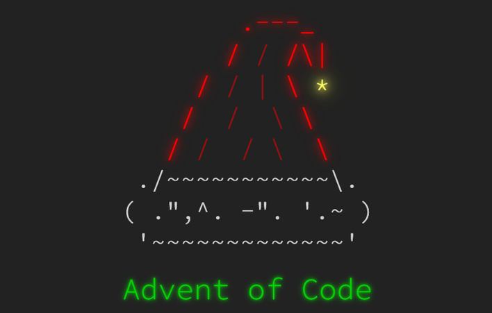

# Advent of Code Solutions

This repo contains my solutions to the annual Advent of Code Challenges. I'm posting these publicly to show my progression in completeing a challenge like this. I first started with this challenge in 2022 and decided that I will also complete the others as time permits. These are not 100% optimized solutions. My goal is to get the answer, and then optimize it from there.



My solutions will be completed in Javascript as much as I can. Due to my career and hobbies I'm not competing for best score or time as I'm looking to just have fun and learn along the way. With the inception of ChatGPT, I am not allowing myself to use it or any other AI tool to complete this. I'm am only allowing myself to use JS docs, stackoverflow, and other online forums.

If any solutions are missing from this repo but they are listed in the leaderboard tables, this means I need to convert them into my standardized format yet.

## My Leaderboard (2024)

|     | Part 1   |       |       | Part 2   |       |       |
| :-: | -------- | ----- | :---: | -------- | ----- | :---: |
| Day | Time     | Rank  | Score | Time     | Rank  | Score |
|  1  | 17:45:20 | 95128 |   0   | 18:02:14 | 89915 |   0   |
|  6  | 06:07:18 | 32027 |   0   | 07:55:50 | 20719 |   0   |
|  7  | 09:04:11 | 32314 |   0   | 09:07:28 | 29414 |   0   |
|  8  | 08:28:57 | 28783 |   0   | 09:45:53 | 28656 |   0   |

## My Leaderboard (2023)

|     | Part 1 |        |       | Part 2 |        |       |
| :-: | ------ | ------ | :---: | ------ | ------ | :---: |
| Day | Time   | Rank   | Score | Time   | Rank   | Score |
|  1  | >24h   | 318801 |   0   | >24h   | 239909 |   0   |
|  2  | >24h   | 214270 |   0   | >24h   | 204193 |   0   |

## My Leaderboard (2022)

|     | Part 1   |        |       | Part 2   |        |       |
| :-: | -------- | ------ | :---: | -------- | ------ | :---: |
| Day | Time     | Rank   | Score | Time     | Rank   | Score |
|  1  | 20:46:29 | 122810 |   0   | 20:58:12 | 118047 |   0   |
|  2  | 21:01:42 | 117504 |   0   | 21:24:58 | 111634 |   0   |
|  3  | 09:25:32 | 61985  |   0   | 10:18:14 | 59323  |   0   |
|  4  | 09:44:47 | 65676  |   0   | 10:07:45 | 64958  |   0   |
|  5  | 01:18:57 | 13922  |   0   | 01:25:25 | 13251  |   0   |
|  6  | 00:11:57 | 7480   |   0   | 00:15:30 | 7646   |   0   |
|  7  | >24h     | 116387 |   0   | 00:15:30 | 113762 |   0   |

## My Leaderboard (2015)

|     | Part 1 |       |       | Part 2 |       |       |
| :-: | ------ | ----- | :---: | ------ | ----- | :---: |
| Day | Time   | Rank  | Score | Time   | Rank  | Score |
|  1  | >24h   | 85283 |   0   | >24h   | 69785 |   0   |
|  2  | >24h   | 54552 |   0   | >24h   | 49184 |   0   |

## Setup & Execution

The solutions are broken out in folders by the days. I'm developing the solutions by running the javascript file in Nodemon, this way it auto runs upon saving.

Each day I login to the [Advent of Code](https://adventofcode.com) and get the input file and save it to the same folder.

```bash
npm install

# Node.js
node index.js <year>/<day number>

#eg: node index.js 2024/2
```

I wanted a way to copy a template for each new day to streamline my setup. I have the template files in `/templates/` and they can be utilized with a single command. This will create the folder and also start the solution.

```bash
# Node.js
node index.js <year>/<day> -create

#eg: node index.js 2024/2 -create
```

## Development Mode

When developing the code to the solutions, I utilized Nodemon to keep reloading the new code after I save it. It just saves a little bit of time and piece of mind.

```bash
# Development mode (Requires Nodemon )
npm i -g nodemon
npm install

npm run dev <year>/<day number> -dev
#eg: npm run dev 2024/2 -dev
```

#### Running Test/Real Inputs

You can disable execution of either or both the test and real data by changing the state of the mode in the top of the `/year/day/index.js` file. It will skip the ones that are set to false.

```js
const modes = {
  dev: true,
  real: false,
};
```

You can also place in the correct answers for the test input into the same area.

```js
const correctDevPart1 = 41;
const correctDevPart2 = 6;
```
